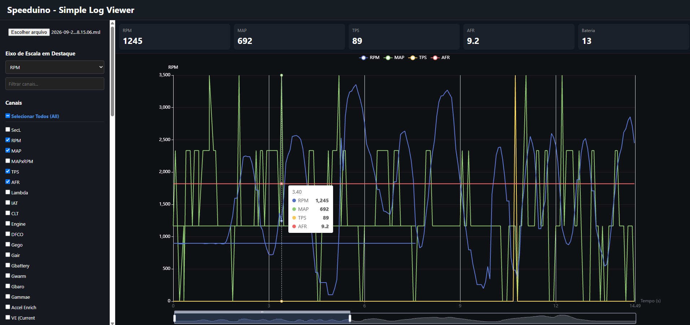

# Speeduino Log

Para acessar o projeto acesse: [Speeduino Log Viewer Online](https://wfp2002.github.io/speeduinolog)

Para que o Log funcione corretamente mude para o formato ASCII conforme a imagem abaixo no TunerStudio.

Ao entrar apenas clique em selecionar o arquivo .msl gerado.

