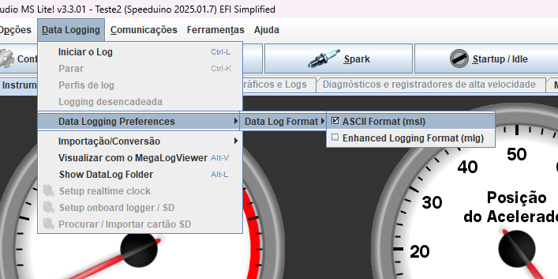
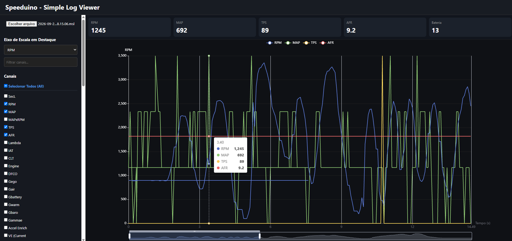

# Speeduino Log

Para versao online do projeto acesse: [Speeduino Log Viewer Online](https://wfp2002.github.io/speeduinolog)

Para que o Log funcione corretamente mude para o formato ASCII conforme a imagem abaixo no TunerStudio.

Apos gerar o arquivo no tunerStudio, o mesmo sera criado na pasta DataLogs do projeto com a extensao .msl, entao é só abrir esse arquivo no Speeduino Log Viewer, clicando no botao "Escolher Arquivo".

Na versao 1.1, tambem pode ser aberto um arquivo de log dinamico com extensao "csv" de acordo com o que o usuario preferir. Veja os detalhes no arquivo: layout_csv.txt
